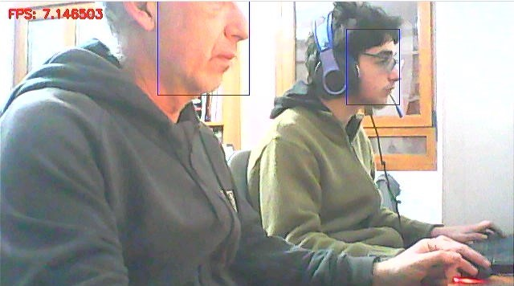
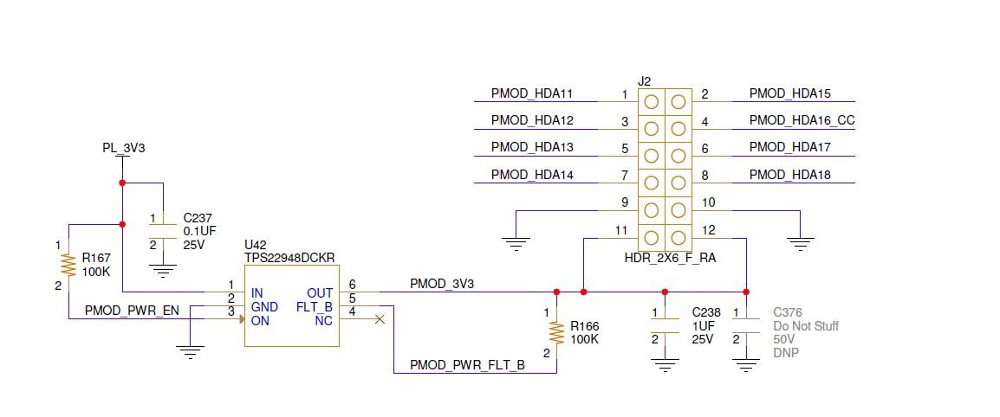
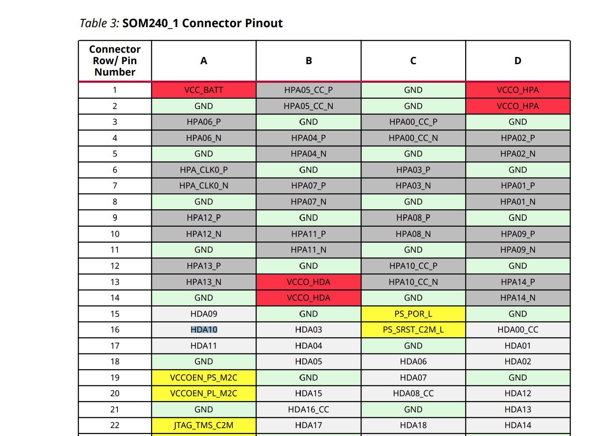

# Kria Kitchen Lifeguard
Xilinx Kria KV260 Kitchen Lifeguard

## Setting the Kria KV260
You have to install the Vitis AI Runtime on your own image. The version of the board image should be 2021.2 or above.


### Step 1: Installing a Board Image
A system images for the KV260 starter kit can be downloaded from [here](https://login.xilinx.com/app/xilinxinc_f5awsprod_1/exknv8ms950lm0Ldh0x7/sso/saml)

### Step 2: Flash OS Image to the SD card
You can use etcher (https://etcher.io/)


## Install Vitis AI Library User Guide

[Vitis AI Library User Guide (UG1354)](https://docs.xilinx.com/r/en-US/ug1354-xilinx-ai-sdk/Introduction)

## Clone repository
```
git clone --recurse-submodules https://github.com/javagoza/KriaKitchenLifeguard kriaklifeguard
```
## Build
```
cd kriaklifeguard/
```
```
bash -x build.sh
```
The build script will call g++

```
g++ -std=c++17 -O2 -I. -o klifeguard klifeguard.cpp -lvitis_ai_library-facedetect -lvitis_ai_library-dpu_task -lvitis_ai_library-xnnpp -lvitis_ai_library-model_config -lvitis_ai_library-math -lvart-util -lxir -pthread -ljson-c -lglog -I/usr/include/opencv4 -lopencv_core -lopencv_videoio -lopencv_imgproc -lopencv_imgcodecs -lopencv_highgui
```

## Execute

./klifeguard densebox_320_320 0 -t 8

./klifeguard densebox_640_360 0 -t 8


## Face Detection
The Kitchen ML Lifeguard uses the Face Detection library.
Face Detection uses the DenseBox neural network to detect human faces. The input is a picture with the faces you want to detect and the output is a vector containing the information of each detection box. 




vitis::ai::FaceDetect
Base class for detecting the position of faces in the input image (cv::Mat).
Input is an image (cv::Mat).

Output is a vector of position and score for faces in the input image.

Sample code:

```
auto image = cv::imread("sample_facedetect.jpg");
auto network = vitis::ai::FaceDetect::create(
               "densebox_640_360",
               true);
auto result = network->run(image);
for (const auto &r : result.rects) {
   auto score = r.score;
   auto x = r.x * image.cols;
   auto y = r.y * image.rows;
   auto width = r.width * image.cols;
   auto height = r.height * image.rows;
}
```

### Hardware

#### ML Starter Kit Carrier Card PMOD connector





[Kria SOM Carrier Card Design Guide](https://www.xilinx.com/support/documentation/user_guides/som/ug1091-carrier-card-design.pdf)


